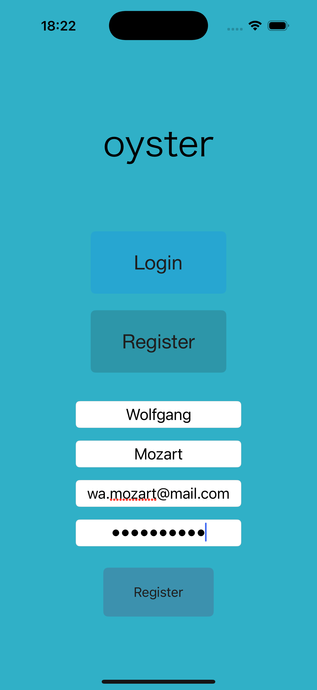
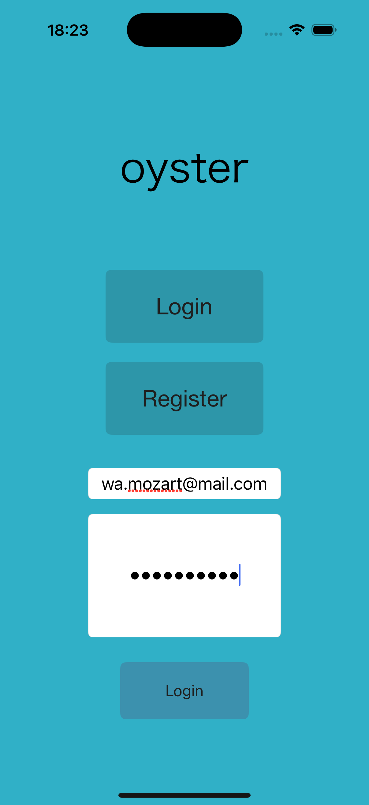
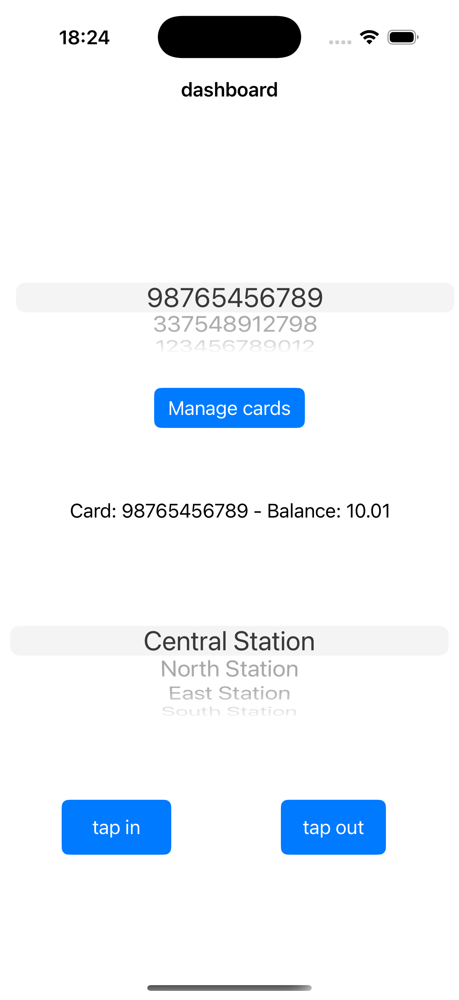
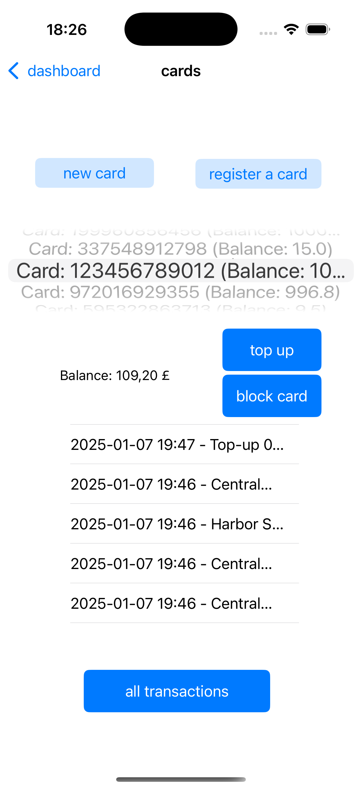
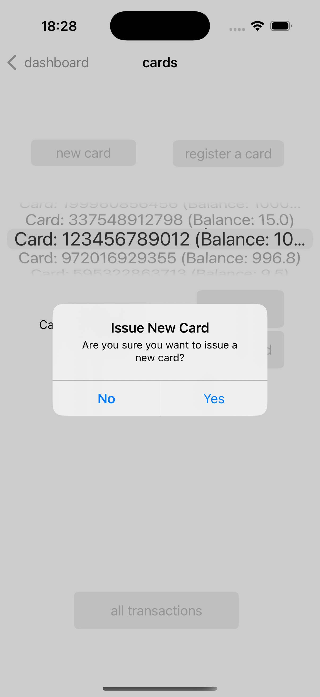
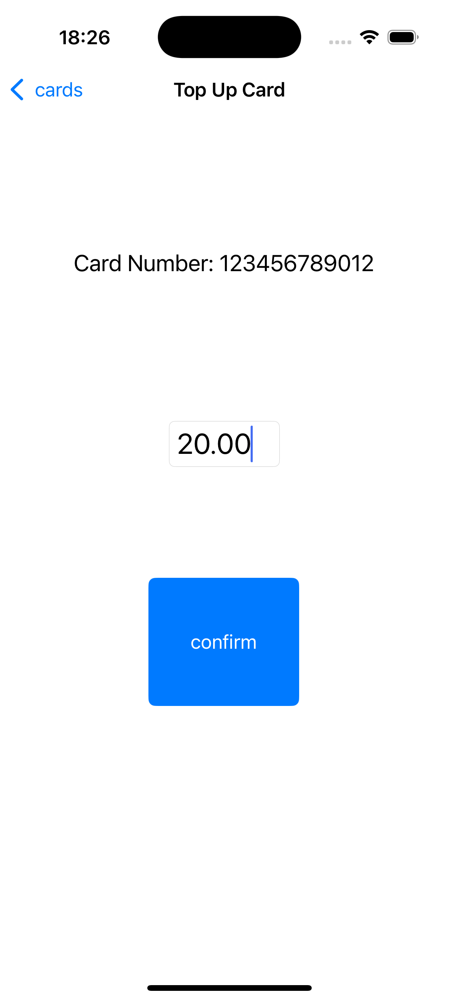
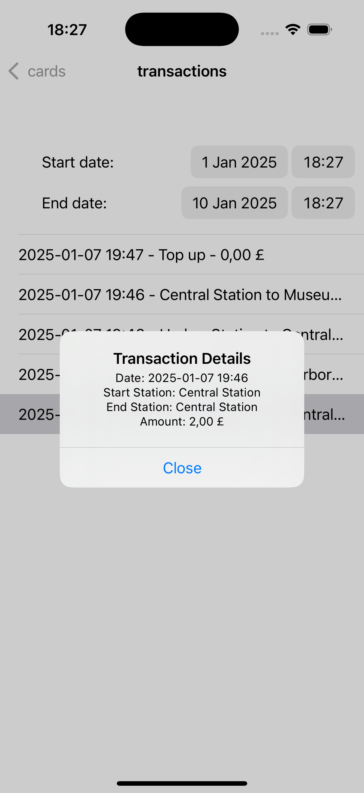
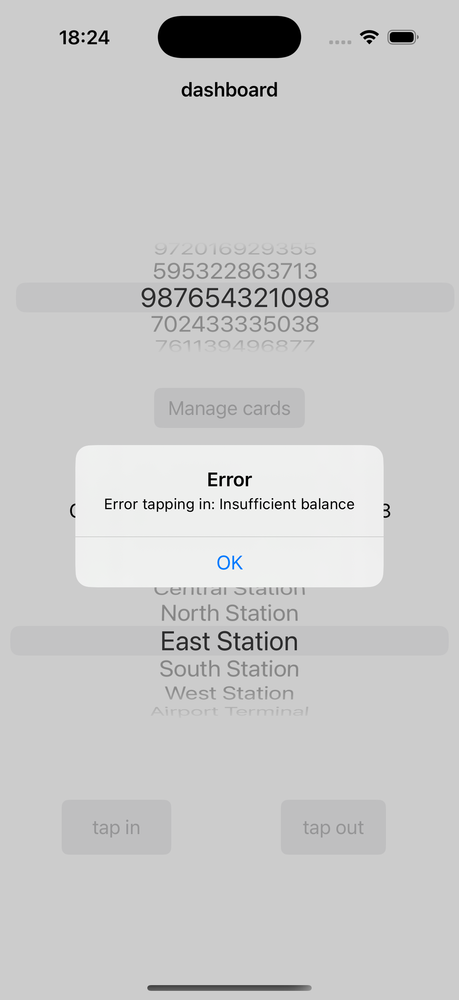
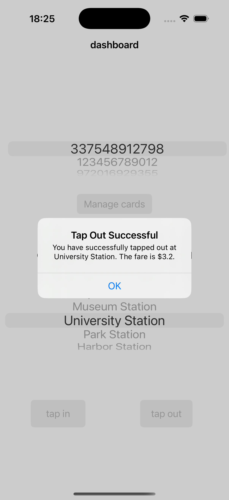

# Oyster Card System API

The __Oyster API__ is an app designed to imitate public transportation system in London. This __RESTful API__ supports functionality to acquire, register, use, top-up, and manage Oyster cards with integrated transaction tracking and security features.

## Tech Stack

- **Java**: The primary programming language used for the backend.
- **Spring Boot**: A framework that simplifies the development of RESTful services.
- **PostgreSQL**: Primary database.
- **H2 Database**: An in-memory database used for testing purposes.
- **Swift**: The frontend programming language
- **Storyboard**: Used to design the user interface.

## API Functionality  

### User management
- **User registration**: Allows users to create an account with email and password validation.
- **User login**: Secure login functionality for users to access their accounts.

### Card management
- **Getting new card**: Users can acquire a new Oyster card through the system.
- **Registering the card**: Users can register cards.
- **Adding balance**: Users can top up the card through the app.
- **Blocking card**: Users can block cards preventing them from further use.
  
### Transactions management
- **Use card for payments**: Users can use their Oyster cards to pay for a completed travel.
- **View recent transactionss**: Users can preview a list of their most recent transactions, helping them track their travel expenses and top ups.
- **View detailed transactions**: Users can view all of the transactions for a selected card and get detailed information about them.
- **Filter transactions by date**: Users can search and filter transaction history by specific dates.
- **Check card balance**: Users can check the current balance of their cards.

### Security features
- **Insufficient funds handling**: Transactions are rejected if the user does not have enough funds.

## Key learnings

As this was my first project using Swift and developing an iOS app, I learned several valuable lessons:

- Swift language fundamentals: Gained an understanding of Swift's syntax, error handling, and core data structures.
- Storyboard: Learned how to use Storyboard for designing and connecting UI elements.
- Integration with backend: Developed skills in integrating the iOS app with a Spring Boot backend, handling network requests, and managing data flow between the frontend and backend.

## Installation and setup
### Prerequisites
- Java JDK 21
- Gradle
- PostgreSQL (H2 is only used for testing)
- Xcode: Required to run the iOS app
  
### Steps
#### Running the backend:
- Clone the Repository:   
  <code>
git clone https://github.com/edworzynska/oyster.git</code>
- Create PostgreSQL Database:   
  Set up a new PostgreSQL database for the application.
- Build and Run the Application:   
  Navigate to the project directory and use Gradle to build and run the app:   
  <code>./gradlew build</code> to build the app and run the tests      
  <code>./gradlew bootrun
</code>    
  The application will start on the default port: http://localhost:8080
#### Running the iOS App:
- Clone the Repository:   
  <code>
git clone https://github.com/edworzynska/oyster-frontend.git</code>
- Open the Xcode Project:   
  Open the project in Xcode.
- Run the App:   
  Build and run the app on a simulator or physical device through Xcode.

## Screenshots   

    

Registration form    

 
    

Login form      

  

Dashboard view: a view displayed after successful login. Users can select their card and use it to tap in or tap out at the selected station.     

 
  

Card management view: a view where users can issue a new card, register a card, block it and view most recent transactions.   

  

New card alert: users are asked to confirm their request to issue new card.  

  
  

Top up view: users can top up card selected in Card Management View here.

  

Transaction view: users can find all transactions made with selected card here, filter them by dates and view the details such as fare and stations.  

  

  

Error and success alerts: users receive relevant messages in case of error or success.

